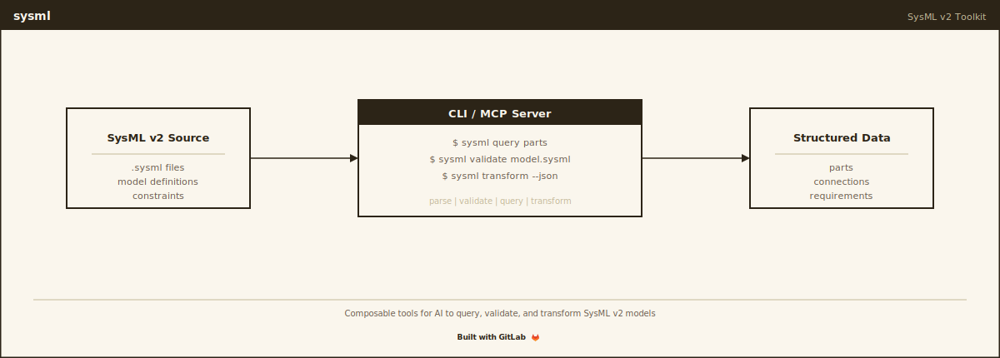

# sysml

[](https://gitlab.com/nomograph/sysml/-/pipelines)
[](LICENSE)
[](https://gitlab.com/nomograph/sysml)
[](https://crates.io/crates/nomograph-sysml)

CLI-native knowledge graph toolkit for SysML v2. Single binary, dual mode
(CLI + MCP server). Part of [Nomograph Labs](https://nomograph.ai).

**Repository**: [gitlab.com/nomograph/sysml](https://gitlab.com/nomograph/sysml)

Built on [tree-sitter-sysml](https://gitlab.com/nomograph/tree-sitter-sysml)
for parsing and inspired by GitLab's [Global Knowledge Graph](https://handbook.gitlab.com/handbook/engineering/architecture/design-documents/gkg/) architecture.

## Install

Requires Rust 1.85 or later.

```bash
cargo install nomograph-sysml
```

With MCP server support:

```bash
cargo install nomograph-sysml --features mcp
```

From source:

```bash
cargo install --path crates/sysml-cli  # binary installs as 'sysml'
```

## Quick Start

```bash
# Build knowledge graph from SysML v2 files
sysml index path/to/model/

# Search for elements
sysml search "ShieldModule"
# => {"total_candidates":42,"results_returned":1,"results":[{"qualified_name":"ShieldModule","kind":"PartDefinition","score":1.0,...}]}

# Trace relationships from an element
sysml trace ShieldModule --hops 3

# Check model completeness
sysml check all --detail

# Query specific relationship types
sysml query --source-name "ShieldModule" --rel satisfy

# Decompose a question into executable steps
sysml plan "Does ShieldModule satisfy MFRQ01?" --execute

# Start MCP server (requires --features mcp)
sysml --mcp
```

## Commands

| Command | Description |
|---------|-------------|
| `parse` | Parse SysML v2 source files |
| `validate` | Check SysML v2 source for errors |
| `index` | Build knowledge graph from files |
| `search` | Search the knowledge graph |
| `inspect` | Exact-name element lookup with full context |
| `trace` | Traverse relationships from an element |
| `check` | Run structural + metamodel completeness checks |
| `query` | Predicate-based relationship search |
| `render` | Template-based reports (traceability matrix, requirements table, completeness) |
| `stat` | Model health dashboard |
| `plan` | Decompose a question into executable CLI commands |
| `diff` | Compare two knowledge graph indexes |
| `scaffold` | Generate SysML v2 scaffold text |
| `skill` | Generate agent skill file |

All commands output JSON to stdout. Use `--format pretty` for indented output.

## Architecture

```
tree-sitter-sysml (grammar, git dependency)
       |
nomograph-core   (generic traits: Graph, Index, Parser, Scorer, Vocabulary)
       |
sysml-core       (SysML v2 domain: walker, graph, vocabulary, render, metamodel)
       |
sysml-cli        (CLI: clap | MCP: rmcp, feature-gated)
```

Domain logic lives in `sysml-core`. CLI and MCP are thin transport wrappers that delegate to the same functions.

## GitLab CI/CD Integration

sysml ships CI templates in `ci/` for model validation gates and MR diff.

### Model Validation Gate

Add to your `.gitlab-ci.yml`:

```yaml
include:
  - local: ci/nomograph-sysml.gitlab-ci.yml

variables:
  NOMOGRAPH_MODEL_DIR: "model/"
  NOMOGRAPH_FAIL_ON_FINDINGS: "true"
```

This runs two jobs on `.sysml` file changes:

- **sysml-validate**: Checks all `.sysml` files for syntax errors (fails pipeline if any)
- **sysml-check**: Indexes the model, runs all completeness checks, generates a health badge

### MR Model Diff

```yaml
include:
  - local: ci/nomograph-mr-diff.gitlab-ci.yml
```

Runs on merge request pipelines when `.sysml` files change. Compares the base branch model against the head branch and produces a `model-diff.json` artifact.

### Health Badge

```bash
sysml stat --badge > model-health.svg
```

Generates a shields.io-style SVG badge showing completeness percentage and element/relationship counts. Colors: green (100%), yellow (>=80%), orange (>=50%), red (<50%).

## Development

```bash
cargo build --workspace
cargo test --workspace
cargo clippy --workspace         # must be clean
cargo fmt --all
```

See [PRD.md](PRD.md) for the full specification and phase history.

## Contributing

See [CONTRIBUTING.md](CONTRIBUTING.md) for grammar sync procedures and coverage test documentation.

## License

MIT -- see [LICENSE](LICENSE)

## Citation

```bibtex
@software{dunn2026sysml,
  author = {Dunn, Andrew},
  title = {nomograph-sysml: {CLI}-native Knowledge Graph Toolkit for {SysML} v2},
  year = {2026},
  url = {https://gitlab.com/nomograph/sysml},
  note = {Nomograph Labs}
}
```

---
Built by Andrew Dunn, April 2026.
